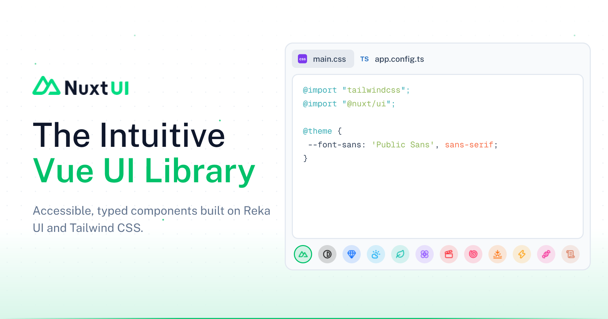

<picture>
  <source media="(prefers-color-scheme: dark)" srcset=".github/assets/banner-dark.png">
  <source media="(prefers-color-scheme: light)" srcset=".github/assets/banner-light.png">
  
</picture>

# Nuxt UI

[![npm version][npm-version-src]][npm-version-href]
[![npm downloads][npm-downloads-src]][npm-downloads-href]
[![License][license-src]][license-href]
[![Nuxt][nuxt-src]][nuxt-href]

Nuxt UI harnesses the combined strengths of [Reka UI](https://reka-ui.com/) and [Tailwind CSS](https://tailwindcss.com/) to offer developers an unparalleled set of tools for creating sophisticated, accessible, and highly performant user interfaces.

> [!NOTE]
> You are on the `v5` development branch, check out the [v4 branch](https://github.com/nuxt/ui/tree/v4) for Nuxt UI v4.

## Documentation

Visit https://ui.nuxt.com to explore the documentation.

## Templates

Kickstart your project with one of our ready-to-use Nuxt UI templates or follow the [Installation Guide](https://ui.nuxt.com/getting-started/installation/nuxt). Explore all available templates on the [official templates page](https://ui.nuxt.com/templates).

- [Starter](https://github.com/nuxt-ui-templates/starter) — A minimal template to get started with Nuxt UI.
- [Landing](https://github.com/nuxt-ui-templates/landing) — A modern landing page template powered by Nuxt Content.
- [Docs](https://github.com/nuxt-ui-templates/docs) — A documentation template powered by Nuxt Content.
- [SaaS](https://github.com/nuxt-ui-templates/saas) — A SaaS template with landing, pricing, docs and blog powered by Nuxt Content.
- [Dashboard](https://github.com/nuxt-ui-templates/dashboard) — A dashboard template with multi-column layout.
- [Chat](https://github.com/nuxt-ui-templates/chat) — An AI chatbot template with GitHub authentication and persistent chat history powered by Vercel AI SDK.
- [Portfolio](https://github.com/nuxt-ui-templates/portfolio) — A sleek portfolio template to showcase your work, skills and blog powered by Nuxt Content.
- [Changelog](https://github.com/nuxt-ui-templates/changelog) — A changelog template to display your repository releases notes from GitHub powered by Nuxt MDC.
- [Editor](https://github.com/nuxt-ui-templates/editor) — A rich text editor template powered by TipTap with support for markdown, HTML, and JSON content types.
- [Calendar](https://github.com/nuxt-ui-templates/calendar) — An Apple Calendar-inspired template with day, week and month views, drag and drop and optimistic updates.

## Installation

```bash [pnpm]
pnpm add @nuxt/ui tailwindcss
```

```bash [yarn]
yarn add @nuxt/ui tailwindcss
```

```bash [npm]
npm install @nuxt/ui tailwindcss
```

```bash [bun]
bun add @nuxt/ui tailwindcss
```

### Nuxt

1. Add the Nuxt UI module in your `nuxt.config.ts`:

```ts [nuxt.config.ts]
export default defineNuxtConfig({
  modules: ['@nuxt/ui'],
  css: ['~/assets/css/main.css']
})
```

2. Import Tailwind CSS and Nuxt UI in your CSS:

```css [app/assets/css/main.css]
@import "tailwindcss";
@import "@nuxt/ui";
```

Learn more in the [installation guide](https://ui.nuxt.com/docs/getting-started/installation/nuxt).

### Vue

1. Add the Nuxt UI Vite plugin in your `vite.config.ts`:

```ts [vite.config.ts]
import { defineConfig } from 'vite'
import vue from '@vitejs/plugin-vue'
import ui from '@nuxt/ui/vite'

export default defineConfig({
  plugins: [
    vue(),
    ui()
  ]
})
```

2. Use the Nuxt UI Vue plugin in your `main.ts`:

```ts [src/main.ts]
import './assets/css/main.css'

import { createApp } from 'vue'
import { createRouter, createWebHistory } from 'vue-router'
import ui from '@nuxt/ui/vue-plugin'
import App from './App.vue'

const app = createApp(App)

const router = createRouter({
  routes: [],
  history: createWebHistory()
})

app.use(router)
app.use(ui)

app.mount('#app')
```

3. Import Tailwind CSS and Nuxt UI in your CSS:

```css [src/assets/css/main.css]
@import "tailwindcss";
@import "@nuxt/ui";
```

Learn more in the [installation guide](https://ui.nuxt.com/docs/getting-started/installation/vue).

## Contribution

Thank you for considering contributing to Nuxt UI. Here are a few ways you can get involved:

- Reporting Bugs: If you come across any bugs or issues, please check out the reporting bugs guide to learn how to submit a bug report.
- Suggestions: Have any thoughts to enhance Nuxt UI? We'd love to hear them! Check out the [contribution guide](https://ui.nuxt.com/docs/getting-started/contribution) to share your suggestions.

> [!TIP]
> We provide contributing guidelines through [`AGENTS.md`](https://github.com/nuxt/ui/blob/v5/AGENTS.md) for AI assistants to help you contribute to Nuxt UI. It is automatically picked up by all AI coding agents and guides through component structure, theming patterns, testing conventions, and documentation guidelines.

## Local Development

Follow the docs to [set up your local development environment](https://ui.nuxt.com/docs/getting-started/contribution#local-development) and contribute.

## Credits

- [nuxt/nuxt](https://github.com/nuxt/nuxt)
- [nuxt/icon](https://github.com/nuxt/icon)
- [nuxt/fonts](https://github.com/nuxt/fonts)
- [nuxt-modules/color-mode](https://github.com/nuxt-modules/color-mode)
- [unovue/reka-ui](https://github.com/unovue/reka-ui)
- [tailwindlabs/tailwindcss](https://github.com/tailwindlabs/tailwindcss)
- [vueuse/vueuse](https://github.com/vueuse/vueuse)

## License

Licensed under the [MIT license](https://github.com/nuxt/ui/blob/v5/LICENSE.md).

<!-- Badges -->
[npm-version-src]: https://img.shields.io/npm/v/@nuxt/ui.svg?style=flat&colorA=18181B&colorB=28CF8D
[npm-version-href]: https://npmjs.com/package/@nuxt/ui

[npm-downloads-src]: https://img.shields.io/npm/dm/@nuxt/ui.svg?style=flat&colorA=18181B&colorB=28CF8D
[npm-downloads-href]: https://npm.chart.dev/@nuxt/ui

[license-src]: https://img.shields.io/github/license/nuxt/ui.svg?style=flat&colorA=18181B&colorB=28CF8D
[license-href]: https://github.com/nuxt/ui/blob/v5/LICENSE.md

[nuxt-src]: https://img.shields.io/badge/Nuxt-18181B?logo=nuxt
[nuxt-href]: https://nuxt.com
